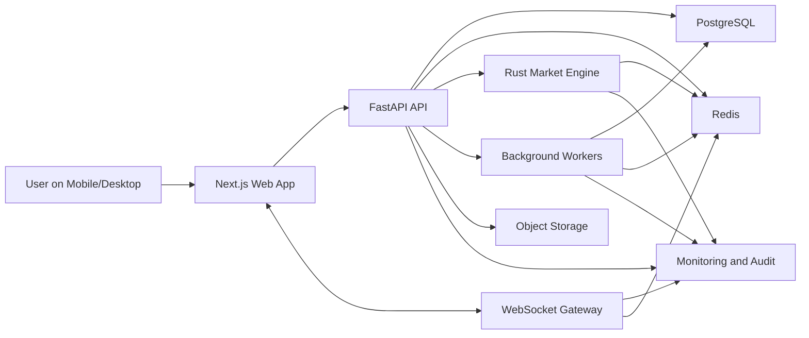

# SokoOdds Implementation Guide

## Goal

Build a Kenya-first, Polymarket-style prediction market platform with a modern trading feel, localized trust signals, and a visual identity inspired by East African craft, color, and rhythm.

Recommended stack:

- Frontend: Next.js + TypeScript + Tailwind CSS + pnpm
- Backend: FastAPI + Python
- Python toolchain: uv + Ruff + Pyright + pytest
- Database: PostgreSQL
- Cache and pub/sub: Redis
- Realtime: WebSockets
- Infra: Docker
- Optional performance layer: Rust market engine

This guide is written as a practical blueprint for implementing `SokoOdds`.

## Product Direction

### Positioning

SokoOdds should feel like:

- A serious prediction trading product
- Built for Kenya and East Africa first
- Mobile-first and low-bandwidth aware
- Clear, trustworthy, and easy to understand

It should not feel like:

- A generic crypto dashboard copied from the US
- A casino skin with random African textures added on top
- An overdecorated tourism aesthetic

### Core Product Principles

1. Trust before hype
2. Fast mobile performance
3. Real-time market movement
4. Clear rules and resolution sources
5. Ledger-grade money movement tracking
6. Local relevance in language, topics, payments, and visuals

## Visual Direction: East African, Contemporary, and Respectful

The design inspiration can draw from Maasai beadwork, shuka color energy, kanga rhythm, matatu boldness, savannah earth tones, and East African market signage, but it should be interpreted as a modern product system rather than costume or stereotype.

### Visual Rules

- Use bold blocks of color with strong contrast
- Introduce geometric dividers and pattern accents inspired by beadwork grids
- Keep data surfaces clean and trading-focused
- Reserve cultural expression for framing elements, accents, empty states, onboarding, and hero surfaces
- Avoid literal costume imagery or overusing tribal motifs

### Suggested Brand Personality

- Confident
- Fast
- Grounded
- Social
- Local
- Sharp

### Color System

Use a palette inspired by Maasai reds, bead blues, clay, gold, and warm ivory.

```txt
Brand Red:      #B33A2B
Clay Orange:    #C96B2C
Bead Blue:      #0F6B78
Savannah Gold:  #C9A227
Charcoal:       #111315
Warm Ivory:     #F6F0E5
Dust Sand:      #D9C7A4
Success Green:  #1F7A4D
Alert Amber:    #A76416
Danger Deep:    #8D1F1F
```

### Tailwind Token Direction

Define the design system through CSS variables first, then map them into Tailwind.

```css
:root {
  --bg: 246 240 229;
  --fg: 17 19 21;
  --surface: 255 250 241;
  --surface-2: 239 230 212;
  --brand: 179 58 43;
  --accent: 15 107 120;
  --gold: 201 162 39;
  --success: 31 122 77;
  --danger: 141 31 31;
  --border: 196 174 138;
}
```

### Typography

Use a combination that feels editorial and product-grade:

- Headings: `Space Grotesk` or `Sora`
- Body UI: `Manrope` or `IBM Plex Sans`
- Numeric tables and order book: `IBM Plex Mono`

### Pattern Language

Use pattern sparingly:

- Thin beadwork-inspired border strips on hero cards
- Angular separators between major homepage sections
- Subtle background dot or stitch grids in onboarding and empty states
- Market category badges inspired by woven-label shapes

### Motion

Motion should feel purposeful:

- Price ticks animate quickly and clearly
- Market cards reveal with staggered upward motion
- Large surfaces can use slow panning gradients inspired by sunrise over savannah landscapes
- Keep trading interactions fast and minimal

### UX Localization

Design for local trust and accessibility:

- Support English first, with room for Swahili labels later
- Show KES everywhere by default
- Make timestamps easy to read in East Africa time zones
- Use simple plain-language market rules
- Design for mobile screens before desktop polish

## UX Benchmarking Rule

Do not design important SokoOdds flows in isolation. Before building major user-facing surfaces, review relevant benchmark products and turn those observations into concrete component and copy decisions.

Use this benchmark lens:

- Polymarket for discovery, market-card hierarchy, and live trading surfaces
- Kalshi and Bayse for trust, integrity, and contract discipline
- PredictIt for closure, pause, and resolution messaging
- 5050 Markets and Spreadhit for Kenya-native payment and category cues
- Predicta for explicit balance states and user guidance
- Stripe for calm information hierarchy, form clarity, and high-trust financial UX

For each major flow, write a short `copy / localize / avoid` note before implementation starts.

### Stripe-Inspired Product Rules

Stripe is a strong benchmark for financial product clarity even though it is not a prediction market.

Borrow these patterns:

- strong page hierarchy with one obvious primary action
- modular sections instead of crowded all-in-one screens
- inline validation and helper text on money forms
- clear status labels, next-step messaging, and timing expectations
- trust proof close to the action surface

Apply them to SokoOdds like this:

- wallet and deposit screens should explain what happens next
- order tickets should show payout, reserved funds, and confirmation states clearly
- market pages should keep the question, rules, and current price visible without clutter
- admin resolution flows should make evidence and audit implications explicit

## Product Scope

### MVP Features

- User sign up and sign in
- Market discovery
- Binary markets: YES / NO
- Market detail page
- Order placement
- Order book
- Recent trades
- Portfolio and P&L
- Wallet and ledger view
- Admin market creation and resolution
- Realtime updates over WebSockets

### Phase 2 Features

- Comments and discussion
- Push notifications
- Watchlists
- Category pages
- Market creator workflow
- Fraud monitoring and risk scoring
- Regional expansion beyond Kenya
- Rust market engine for low-latency matching and market-state processing

## Recommended Monorepo Layout

```txt
SokoOdds/
  package.json
  pnpm-workspace.yaml
  pnpm-lock.yaml
  .python-version
  pyproject.toml
  uv.lock
  apps/
    market-engine/
      Cargo.toml
      src/
      tests/
    api/
      pyproject.toml
      alembic.ini
      app/
      tests/
      Dockerfile
    web/
      package.json
      app/
      components/
      lib/
      hooks/
      types/
      public/
      Dockerfile
    worker/
      tests/
      pyproject.toml
    ws-gateway/
      pyproject.toml
  packages/
    shared-types/
    shared-events/
    openapi-client/
  infra/
    compose/
      compose.yaml
      compose.prod.yaml
    docker/
    nginx/
    terraform/
  scripts/
    seed.py
    migrate.sh
  docs/
    kenya-polymarket-implementation-guide.md
    architecture/
    api/
    runbooks/
```

## High-Level Architecture



### Operational Service Map

```txt
Users / Browsers
  -> Next.js frontend
    -> FastAPI API for business workflows
    -> WebSocket gateway for live updates
    -> Object storage for attachments and media

FastAPI API
  -> PostgreSQL for durable data
  -> Redis for cache, streams, and fanout
  -> Background workers for settlement, notifications, and reports

Rust market engine
  <- order and market commands from Redis Streams
  -> execution results and market updates back to Redis

WebSocket gateway
  <- live update channels from Redis
  -> authenticated market and portfolio subscriptions to clients
```

### Request and Trading Flow

1. User opens a market page in Next.js
2. Next.js fetches market data from FastAPI
3. User submits a buy or sell order
4. FastAPI validates auth, market state, KYC status, and available balance
5. FastAPI writes the submitted order, reserved-funds hold, and outbox event transactionally in PostgreSQL
6. An outbox publisher forwards `order.created` to Redis Streams
7. Rust consumes the event, matches or queues the order, and emits execution results such as `order.accepted`, `order.rejected`, `trade.executed`, and `market.updated`
8. A FastAPI worker finalizes durable trade, position, and ledger updates in PostgreSQL
9. Redis Pub/Sub fan-outs market and user update events to the WebSocket layer
10. WebSocket clients receive updated prices, order book, portfolio, and wallet state

## Hybrid Python and Rust Service Boundaries

The best-practice version of this stack is not to rewrite everything in Rust. Keep FastAPI as the main product backend and introduce Rust only for workloads that truly need low-latency, concurrency-heavy processing.

### Keep These in FastAPI

- auth and session management
- user profiles
- KYC workflows
- market creation and moderation
- market resolution orchestration
- wallet APIs
- reporting and admin CRUD
- public REST APIs
- early-stage WebSocket support

### Move These to Rust Only When Needed

- matching engine
- in-memory order book management
- live market-state aggregation
- low-latency risk checks
- high-throughput event consumers
- dedicated WebSocket fanout at scale
- fraud or anomaly stream processors

### First Rust Service to Add

Add one focused Rust service first: `market-engine`.

Responsibilities:

- consume order command events
- maintain hot order book state per market
- apply price-time priority matching
- emit trades and market-state updates
- publish portfolio-impact events for downstream consumers

This keeps the architecture clean while giving Rust a real reason to exist.

## Service Boundaries

To avoid hard-to-debug race conditions, each service should have clear ownership.

### Next.js Frontend

Owns:

- public website
- market browsing UI
- market detail page
- trading ticket UI
- portfolio screens
- wallet and account screens
- admin console UI

Does not own:

- matching logic
- settlement logic
- balance truth
- KYC decisions
- market resolution policy

Calls:

- FastAPI REST APIs for business actions and page data
- WebSocket gateway for live price, trade, and portfolio updates

### FastAPI API Service

Owns:

- external API contracts
- authentication and authorization
- user and admin workflows
- KYC workflow state
- market lifecycle state
- rule text and resolution-source metadata
- wallet and ledger orchestration
- compliance and audit workflows
- settlement orchestration

Should expose:

- `/auth/*`
- `/users/*`
- `/markets/*`
- `/orders/*`
- `/portfolio/*`
- `/wallet/*`
- `/admin/*`
- `/resolution/*`

Should not own:

- low-latency matching engine internals
- high-frequency in-memory order book state

### Rust Market Engine

Owns:

- order-book state machines
- per-market sequencing during matching
- price-time-priority execution
- best bid and best ask calculation
- partial fill logic
- market-state snapshots for hot paths
- short-latency exposure and risk checks

Consumes:

- `order.created`
- `order.cancel_requested`
- `market.paused`
- `market.resumed`

Produces:

- `order.accepted`
- `order.rejected`
- `trade.executed`
- `market.updated`
- `exposure.updated`

Should not own:

- user authentication
- KYC forms
- payment integrations
- market resolution policy
- admin CRUD

### WebSocket Gateway

Owns:

- authenticated live client connections
- room and channel subscriptions
- fanout of market and portfolio updates
- presence and subscription lifecycle

Subscribes to:

- Redis Pub/Sub channels
- Redis Streams projections when replay or catch-up is needed

Channels:

- `market:{id}:ticker`
- `market:{id}:snapshot`
- `market:{id}:trades`
- `market:{id}:orderbook`
- `user:{id}:portfolio`
- `user:{id}:notifications`

Start with this in FastAPI. Split it into its own service only when fanout load or connection volume justifies it.

### PostgreSQL Remains the System of Record

PostgreSQL should remain the durable truth for:

- users
- markets
- orders
- trades
- positions
- wallets
- ledger entries
- resolutions
- audit logs

Redis is an event transport and cache layer, not the final source of truth.

### Redis

Owns:

- cache
- rate-limiting counters
- short-lived workflow state
- event fanout
- streaming inter-service communication
- hot market summaries
- temporary market snapshots

Good uses:

- publish `market.updated`
- notify the WebSocket gateway
- cache market summaries and trending lists
- throttle aggressive clients

### Background Workers

Owns:

- settlement jobs
- payout batch processing
- email, SMS, and push notifications
- market-close scheduling
- reconciliation jobs
- reporting exports
- fraud review queue processing

Should not own:

- real-time order matching
- hot path trading logic

### Object Storage

Owns:

- market rule attachments
- admin-uploaded evidence
- screenshots
- moderation artifacts
- exports
- static media

### Monitoring and Audit

Owns:

- application logs
- security logs
- trade audit trails
- metrics
- alerts
- request tracing

## Boundary Rules

1. Only PostgreSQL is truth for money, positions, and payouts.
2. Rust owns matching and market-state computation, not user or admin workflows.
3. FastAPI owns external business APIs and policy decisions.
4. Redis is for speed and transport, not final truth.
5. The WebSocket gateway distributes state but does not calculate balances or prices.

## Event-Driven Best Practices

### Use Streams for Critical Events

Use Redis Streams for durable workflow events such as:

- `order.created`
- `order.accepted`
- `order.cancel_requested`
- `order.cancelled`
- `trade.executed`
- `market.paused`
- `market.resumed`
- `market.updated`
- `market.resolved`
- `portfolio.updated`

Use Redis Pub/Sub for ephemeral fanout only, such as broadcasting updates to subscribed WebSocket channels.

### Use the Outbox Pattern

When FastAPI accepts an order, write both the durable record and a matching outbox event in one PostgreSQL transaction. A publisher worker can then forward those outbox records to Redis Streams.

This avoids the classic failure mode where the database write succeeds but the event publish fails, or the reverse.

### Make Consumers Idempotent

Every consumer should be safe to replay:

- event handlers should use event ids
- trade writes should tolerate retries
- position updates should be sequence-aware
- wallet effects should be applied exactly once

### Prefer Per-Market Serialization

The cleanest matching model is one logical writer per market. Instead of many workers racing to mutate the same order book, partition work so each market is processed sequentially inside the Rust engine.

That reduces locking complexity and makes price-time-priority behavior easier to reason about.

### Recommended Durable Write Rule for V1

For v1, prefer this model:

- FastAPI writes all durable records
- Rust returns execution decisions and market-state events
- a FastAPI worker finalizes durable trade, position, and ledger updates

This is easier to debug, easier to audit, and safer to evolve early on.

Only move direct trade persistence into Rust later if scale truly requires it and you have the observability to support it.

### Suggested Internal Contracts

For the first production version:

- FastAPI publishes normalized order commands to Redis Streams
- Rust consumes command events and publishes execution results
- FastAPI workers consume engine results and persist final state
- WebSocket gateway consumes projection events and distributes them to clients

Use HTTP for health and admin control surfaces. Add gRPC only if low-latency synchronous engine calls become necessary.

## Core Request Flows

### Market Page Load

1. User opens `/markets/[slug]`
2. Next.js fetches market summary, rules, and initial depth snapshot from FastAPI
3. FastAPI reads PostgreSQL and any safe Redis cache layers
4. Next.js opens a WebSocket subscription for live market channels
5. The WebSocket gateway streams updates from Redis-backed channels

### Place Order

1. User submits a buy or sell order in the frontend
2. Next.js calls `POST /orders`
3. FastAPI validates auth, KYC, market state, and available funds
4. FastAPI writes a submitted order row, reserve-funds ledger hold, and outbox event in PostgreSQL
5. Redis Streams carries `order.created` to the Rust market engine
6. Rust matches or queues the order
7. Rust emits `trade.executed`, `order.accepted`, or `order.rejected`
8. A FastAPI worker persists final trade, position, and ledger effects
9. Redis Pub/Sub notifies the WebSocket gateway
10. Clients subscribed to market and portfolio channels receive updates

### Market Resolution

1. Admin resolves the market in FastAPI
2. FastAPI creates a durable resolution request in `market_resolution_requests` with evidence and audit metadata
3. High-risk resolutions enter `pending_second_approval` and lock the market in `pending_resolution`
4. A different admin approves or rejects the request
5. Once approved, remaining open orders are cancelled and reserves are released safely
6. A worker starts settlement processing
7. Positions are netted and payouts are computed
8. Ledger entries and wallet balances are updated in PostgreSQL
9. Redis publishes settlement-complete events
10. WebSocket updates and notifications reach affected users

## Frontend Implementation

### Frontend Runtime and Tooling Baseline

Use fast frontend tooling from day one:

- use `pnpm` for installs, workspaces, lockfiles, and script execution
- commit `pnpm-lock.yaml`
- keep the frontend under a repo-level `pnpm` workspace
- run lint, typecheck, tests, and builds through `pnpm`

### Standard Frontend Commands

```bash
pnpm install --frozen-lockfile
pnpm --filter web dev
pnpm --filter web lint
pnpm --filter web typecheck
pnpm --filter web test
pnpm --filter web build
```

### Frontend App Structure

```txt
apps/web/
  app/
    layout.tsx
    page.tsx
    markets/
      page.tsx
      [slug]/
        page.tsx
    portfolio/
      page.tsx
    wallet/
      page.tsx
    account/
      page.tsx
    admin/
      layout.tsx
      page.tsx
      markets/
        page.tsx
      users/
        page.tsx
    api/
      auth/
        [...nextauth]/
          route.ts
  components/
    layout/
      Navbar.tsx
      Sidebar.tsx
      Footer.tsx
    navigation/
    market/
      MarketCard.tsx
      MarketHeader.tsx
      ProbabilityBar.tsx
      PriceChart.tsx
      OrderBook.tsx
      RecentTrades.tsx
      MarketComments.tsx
    trading/
      OrderEntry.tsx
      OrderConfirm.tsx
      PositionCard.tsx
    charts/
      MiniSparkline.tsx
      FullPriceChart.tsx
    wallet/
      DepositForm.tsx
      WithdrawForm.tsx
      TransactionRow.tsx
    admin/
    ui/
  features/
    auth/
    markets/
    orders/
    portfolio/
    wallet/
  lib/
    api/
      client.ts
      markets.ts
      orders.ts
      wallet.ts
      auth.ts
    auth/
      session.ts
    websocket/
      useMarketSocket.ts
    utils/
      format.ts
      constants.ts
  styles/
    globals.css
```

### Main Pages

#### Home

- Hero with strong East African visual identity
- Live platform stats: active markets, total volume, active traders
- Featured markets
- Trending questions
- Categories such as politics, sports, business, entertainment, and global headlines
- Trust section explaining how markets resolve
- Strong CTA for sign up and deposit

#### Markets

- Search
- Filter by category, status, closing date, and volume
- Card and table views
- Probability, liquidity, and time-to-close
- Infinite scroll or straightforward pagination

#### Market Detail

- Market question
- Rules
- Resolution source
- YES and NO price summary
- Chart
- Order ticket
- Order book
- Recent trades
- Market discussion
- Current user position card

#### Portfolio

- Open positions
- Realized and unrealized P&L
- Settled positions
- Trade history

#### Wallet

- Balance
- Available funds
- Reserved funds
- Transaction history
- Payment method status
- Deposit and withdraw forms

#### Account

- KYC status
- Profile settings
- Payment method status

#### Admin

- Create market
- Edit market rules
- Pause or reopen market
- Resolve market
- Review flagged activity
- KYC review and user moderation

### Frontend Technical Choices

- Use Next.js App Router
- Use server components for page shells and market snapshots
- Use client components for order forms, charts, live feeds, and wallet interactions
- Use TanStack Query for API fetching and cache invalidation
- Use `shadcn/ui` as the base component layer, then skin it with the East African design system
- Use Recharts for the first price-history implementation
- Use a dedicated WebSocket client module for market subscriptions
- Prefer optimistic UI only for non-money state; keep order placement confirmations server-driven
- Build a reusable design system layer before making page-specific UI
- Reconnect WebSockets with exponential backoff on flaky mobile networks

### Component Inventory

Create these first:

- `TopNav`
- `MarketCard`
- `ProbabilityPill`
- `PriceChart`
- `OrderTicket`
- `OrderBook`
- `RecentTrades`
- `PortfolioTable`
- `WalletLedgerTable`
- `MarketRulesCard`
- `ResolutionSourceCard`
- `AdminMarketForm`

## Backend Implementation

### Python Runtime and Tooling Baseline

Use a modern Python toolchain from day one:

- use `uv` for Python installation, virtual environments, dependency management, lockfiles, and command execution
- use `Ruff` for both linting and formatting
- use `Pyright` as the authoritative Python type checker in CI and local development
- use `pytest` for tests
- keep dependencies in `pyproject.toml`, not `requirements.txt`, as the source of truth
- commit `uv.lock` for reproducible local, CI, and Docker builds

Recommended practical baseline:

- target CPython `3.13` for the API and worker services
- manage Python versions with `uv`
- use a uv workspace for `apps/api`, `apps/worker`, and optional `apps/ws-gateway`

### Recommended Python Package Set

Core runtime packages:

- `fastapi`
- `pydantic`
- `pydantic-settings`
- `sqlalchemy`
- `alembic`
- `psycopg[binary]`
- `redis`
- `httpx`
- `celery`

Development packages:

- `ruff`
- `pyright`
- `pytest`
- `pytest-asyncio`
- `pytest-cov`

Use the latest stable releases of these packages, but let `uv.lock` pin the exact resolved versions for repeatable environments.

### Python Workspace Files

Use a root-level Python workspace for the backend-facing Python services:

- `.python-version`
- `pyproject.toml`
- `pyrightconfig.json`
- `uv.lock`

Each Python app should keep its own `pyproject.toml`, while the workspace shares one lockfile.

### Suggested `pyproject.toml` Shape

```toml
[project]
name = "sokoodds-python"
version = "0.1.0"
requires-python = ">=3.13,<3.15"

[dependency-groups]
dev = [
  "ruff",
  "pyright",
  "pytest",
  "pytest-asyncio",
  "pytest-cov",
]

[tool.uv.workspace]
members = ["apps/api", "apps/worker", "apps/ws-gateway"]

[tool.ruff]
line-length = 100
target-version = "py313"

[tool.ruff.lint]
select = ["E", "F", "I", "B", "UP"]
```

If `ws-gateway` remains inside the main API for MVP, remove it from the workspace members until it becomes a separate Python package.

Pair the workspace with a root `pyrightconfig.json` that includes `apps/api` and `apps/worker`, uses explicit execution environments per service root, and starts with `strict` mode while disabling missing-stub noise for third-party packages that do not ship full type information yet.

### Standard Python Commands

Use `uv` commands consistently in local development, CI, and Docker:

```bash
uv sync
uv lock
uv run ruff check .
uv run ruff format .
uv run pyright
uv run pytest
uv run uvicorn app.main:app --reload
```

In CI and Docker, prefer:

```bash
uv sync --locked
uv lock --check
```

### FastAPI App Structure

```txt
apps/api/
  pyproject.toml
  alembic.ini
  app/
    main.py
    api/
      v1/
        router.py
        routes/
          auth.py
          users.py
          markets.py
          orders.py
          trades.py
          positions.py
          wallet.py
          payments.py
          admin.py
          resolution.py
          websocket.py
    core/
      config.py
      database.py
      security.py
      redis.py
      logging.py
      dependencies.py
    models/
      user.py
      market.py
      order.py
      trade.py
      position.py
      wallet.py
      ledger.py
      payment.py
      price_history.py
      resolution.py
      audit_log.py
    schemas/
      auth.py
      market.py
      order.py
      trade.py
      wallet.py
      user.py
    services/
      auth_service.py
      market_service.py
      order_intake_service.py
      portfolio_service.py
      wallet_service.py
      payout_service.py
      payment_service.py
      notification_service.py
    workers/
      celery_app.py
      settlement_worker.py
      notification_worker.py
      analytics_worker.py
      engine_result_consumer.py
      outbox_publisher.py
      tasks/
        process_payment.py
        send_notification.py
        trade_consumer.py
    websocket/
      manager.py
      events.py
    migrations/
      env.py
      versions/
```

### Backend Domains

Split backend logic by domain:

- Auth and users
- Markets
- Orders intake
- Trades and positions queries
- Portfolio
- Wallet and ledger
- Payments and callbacks
- Resolution
- Notifications
- Admin and moderation
- Audit and analytics

The matching engine should not live as a large block of Python business logic inside the main API if you plan to support live trading at scale. Keep order intake in FastAPI and move low-latency matching into the Rust service when needed.

### Worker Service Shape

`apps/worker` should be a separate runtime service, even if it shares Python dependencies or code modules with `apps/api`.

It should own:

- settlement jobs
- reconciliation jobs
- payment follow-up tasks
- notification dispatch
- background event consumers that do not belong on the request path

### API Responsibilities

- Manage user identity and auth sessions
- Return market lists and market detail
- Accept, validate, and enqueue orders for execution
- Track user positions and balances
- Handle payment initiation and provider callbacks
- Resolve markets and settle payouts
- Stream market updates
- Record audit logs for sensitive actions

### FastAPI Order Placement Flow

Use this boundary for `POST /api/v1/orders`:

1. authenticate the user
2. validate the market is open and not expired
3. validate KYC status
4. validate price bounds and quantity
5. compute the required reserved amount
6. ensure available balance can cover the order
7. in one transaction:
   write the order row
   move wallet funds from available to reserved
   append an `ORDER_RESERVE` ledger entry
   append an outbox event
8. publish `order.created` from the outbox to Redis Streams
9. return the accepted order intent to the client

### FastAPI Settlement Flow

Use this boundary for `POST /api/v1/admin/markets/{id}/resolve`:

1. require admin authorization
2. mark the market resolved with outcome and evidence
3. cancel remaining open orders
4. release reserved funds on cancelled orders
5. compute winner payouts and platform fees
6. credit wallets and append payout ledger entries
7. publish market resolution events for realtime clients and notifications

## Rust Market Engine

### Rust Service Structure

```txt
apps/market-engine/
  src/
    main.rs
    config.rs
    db.rs
    redis_client.rs
    api/
      mod.rs
      routes.rs
    consumers/
      order_events.rs
    engine/
      order_book.rs
      matcher.rs
      pricer.rs
      risk.rs
    models/
      events.rs
      market.rs
      order.rs
      trade.rs
      market_state.rs
    workers/
      order_consumer.rs
      trade_publisher.rs
  tests/
  Cargo.toml
```

### Rust Responsibilities

Use Rust for:

- matching incoming orders
- maintaining market-local in-memory books
- computing best bid, best ask, and last trade
- generating compact market snapshots
- running low-latency pre-trade risk checks when necessary
- emitting execution results back to the platform event bus
- serving a tiny internal HTTP surface for health and optional book snapshots

### Rust Tech Choices

- `Tokio` for async runtime
- `Axum` if the service needs a small control API
- `SQLx` for PostgreSQL access
- `redis-rs` for Streams and Pub/Sub
- `Serde` for event serialization

### What Rust Should Not Own at First

- user auth
- KYC and compliance forms
- admin market CRUD
- reporting
- settlement orchestration
- payment integrations
- direct wallet or ledger finalization in v1

### Rust Operational Rules

- keep order books in memory for hot-path matching
- hydrate all open books from PostgreSQL on startup before consuming new events
- persist the last consumed Redis Stream offset so recovery does not replay blindly
- publish market updates immediately after each trade, not in batches
- keep the internal Axum API private to the service network

### Internal Rust API

Expose only small internal endpoints such as:

- `GET /internal/health`
- `GET /internal/book/{market_id}`

## Market Model

### Initial Market Type

Start with binary markets only:

- `YES`
- `NO`

Each market should have:

- slug
- title
- short description
- long rules
- category
- yes_price
- no_price
- total_volume
- liquidity
- open time
- close time
- resolve time
- resolution source
- status
- settlement result

### Market States

- Draft
- Scheduled
- Open
- Paused
- Closed
- Resolved
- Cancelled

## Trading Model

### Suggested MVP Trading Logic

Use a binary market with price-time-priority matching. Keep the engine simple and consistent before adding advanced market mechanics.

Each order should include:

- user id
- market id
- outcome side: yes or no
- direction: buy or sell
- order type: limit first
- quantity
- price
- status

### Matching Rules

1. Match orders only within the same market and same outcome
2. Use price priority first
3. Use time priority second
4. Process one ordered event stream per market
5. Finalize durable execution state transactionally
6. Update positions, reserved balance, and ledger entries in the same unit of work

### Pricing Model

Treat shares as KES-denominated contracts priced from `0.01` to `0.99`.

- a YES share bought at `0.65` costs KES `0.65`
- a winning share settles at KES `1.00`
- YES and NO prices should approximately sum to `1.00`, allowing for spread

When book depth is thin, fall back carefully to the last durable market price instead of inventing a synthetic value.

### Order Validation Rules

Before an order enters matching:

- require authenticated user
- require approved KYC if trading is gated
- ensure the market is open
- ensure `0.01 <= price <= 0.99`
- ensure quantity is positive and within limits
- ensure available balance covers reserved exposure

Cost should be computed deterministically as:

- `cost = price * quantity`

### Idempotency Rule

Require a client-supplied `Idempotency-Key` header for money-sensitive POST endpoints.

Recommended v1 behavior:

- frontend should generate one UUID per user action and reuse it across retries
- persist idempotency records in PostgreSQL
- scope them by `user_id + route + key`
- enforce idempotency scope with a database-level unique constraint
- return the original status code and response body for exact replays
- include an idempotency status hint such as `created` or `replayed`
- reject same-key different-payload replays with `409 Conflict`
- retain order keys for at least 24 hours
- retain payment keys for at least 72 hours
- clean up expired records on a schedule using `expires_at`

Redis can speed up hot idempotency lookups, but it should not be the only place these records live in a money-moving system.

### Order Lifecycle Best Practice

Use a clear lifecycle so the API and market engine do not blur responsibilities:

1. `submitted`
2. `accepted`
3. `queued_for_matching`
4. `partially_filled`
5. `cancellation_requested`
6. `filled`
7. `cancelled`
8. `rejected`

The API should accept or reject the request at the boundary, while the matching engine advances execution states.

### Risk Control Model

Fast checks should happen before the order is queued:

- market is open
- user is authenticated
- user passes KYC gate
- quantity and price are valid
- available balance covers reserved exposure

The Rust engine can later add tighter low-latency controls:

- max position size
- self-trade prevention
- burst order throttles
- suspicious pattern flags
- rapid market swing guardrails
- duplicate-order suppression

### Ledger Rules

Never rely on a single balance number only. Use double-entry style ledger records.

Track:

- account credits
- account debits
- reserved funds
- released funds
- trade execution
- settlement payout
- fees
- manual admin adjustments

Ledger writes should remain explicit and auditable even if matching moves into Rust. Never collapse balance logic into only in-memory engine state.

### Financial Integrity Rules

- all wallet, order, and ledger changes must be atomic
- use reserved-balance accounting for open orders
- ledger records must be append-only
- default to charging platform fees on payout, not on each trade, unless regulation or product design changes

### Cancellation and Replay Rules

Support cancellation and recovery from day one:

- order cancels should flow through the same event pipeline as new orders
- order books should be reconstructable from durable events and snapshots
- market-state replay should be possible after service restart
- sequence numbers should protect clients from out-of-order updates

## Database Design

### Core Tables

- `users`
- `sessions`
- `kyc_profiles`
- `markets`
- `market_outcomes`
- `market_rules`
- `market_resolution_requests`
- `payment_accounts`
- `orders`
- `trades`
- `positions`
- `wallets`
- `ledger_entries`
- `payments`
- `price_history`
- `deposits`
- `withdrawals`
- `market_resolutions`
- `audit_logs`
- `notifications`

### Important Constraints

- Unique market slug
- Foreign keys across trading entities
- Transaction-safe order matching
- Indexes on market status, close time, trade time, and user portfolio lookups
- Check constraints for valid statuses and positive quantities

### Schema Notes

- `wallets` should separate `available_balance` and `reserved_balance`
- `orders` should track `filled_quantity`
- `positions` should keep `shares`, `avg_price`, and realized P&L
- `payments` should store provider references, phone, status, and confirmation timestamps
- `price_history` should capture market price ticks for charting

### PostgreSQL Notes

Use PostgreSQL for:

- transactional consistency
- row-level locking in matching flows
- JSONB for flexible metadata
- strong indexing for market discovery and portfolio queries

### Write Ownership by Service

FastAPI-owned tables:

- `users`
- `sessions`
- `kyc_profiles`
- `markets`
- `market_rules`
- `market_resolution_requests`
- `payment_accounts`
- `deposits`
- `withdrawals`
- `audit_logs`

Shared but controlled tables:

- `orders`
- `trades`
- `positions`
- `wallets`
- `ledger_entries`

Best practice for v1:

- FastAPI writes final durable records after Rust returns execution decisions
- Rust focuses on execution logic and event output

That split reduces cross-service write contention and makes early debugging much easier.

## Redis Usage

Use Redis for:

- Redis Streams for durable event transport
- Redis Pub/Sub for WebSocket fan-out
- caching hot market data
- rate limiting
- short-lived session or OTP workflows
- queue coordination for background jobs

Recommended channels and streams:

- stream `orders` for new order commands
- stream `trades` for execution results and downstream processing
- channel `market:{id}` for market-scoped live updates
- channel `user:{id}:portfolio` for user-specific updates

### Event Contract Examples

`order.created`

```json
{
  "order_id": "uuid",
  "market_id": "uuid",
  "user_id": "uuid",
  "side": "YES",
  "direction": "BUY",
  "price": "0.6500",
  "quantity": "100.00"
}
```

`trade.executed`

```json
{
  "trade_id": "uuid",
  "market_id": "uuid",
  "buyer_id": "uuid",
  "seller_id": "uuid",
  "side": "YES",
  "price": "0.6500",
  "quantity": "50.00"
}
```

`market:{id}:ticker` pub/sub message

```json
{
  "type": "price_update",
  "data": {
    "yes_price": 0.65,
    "no_price": 0.35,
    "volume": 15000.0
  }
}
```

## Realtime Design

### WebSocket Channels

Suggested channels:

- `market:{market_id}:ticker`
- `market:{market_id}:snapshot`
- `market:{market_id}:orderbook`
- `market:{market_id}:trades`
- `user:{user_id}:portfolio`
- `user:{user_id}:notifications`

### Events

- `market_snapshot`
- `price_update`
- `book_update`
- `trade`
- `resolution`
- `position_update`
- `wallet_update`
- `notification`

Suggested market payload types:

- `price_update`
- `trade`
- `book_update`
- `resolution`

### Realtime Scaling Path

Start with WebSockets in FastAPI. Move to a dedicated Rust gateway only when concurrent subscriptions or fanout pressure justify the added complexity.

That gives you a sensible progression:

1. FastAPI WebSockets for MVP
2. Redis-backed fanout for growth
3. Rust gateway for high-scale market subscriptions

Client behavior should include:

- automatic reconnect with exponential backoff
- bounded local buffers for recent trades
- sequence-aware state replacement to avoid stale book updates
- a subscribe or unsubscribe protocol instead of implicit subscribe-all behavior
- an immediate snapshot after successful market subscription to establish a trusted baseline

Every market and portfolio event should include a monotonic `sequence` number so clients can discard stale updates safely. Engine-originated market events should also include `engine_emitted_at` so latency can be measured end to end.

## API Surface

### Public Endpoints

- `GET /api/v1/markets?category=&status=&q=&sort=&page=`
- `GET /api/v1/markets/{slug}`
- `GET /api/v1/markets/{slug}/orderbook`
- `GET /api/v1/markets/{slug}/trades`

### Authenticated Endpoints

- `POST /api/v1/auth/register`
- `POST /api/v1/auth/login`
- `POST /api/v1/auth/refresh`
- `GET /api/v1/auth/me`
- `GET /api/v1/positions`
- `GET /api/v1/trades`
- `GET /api/v1/wallet/balance`
- `GET /api/v1/wallet/transactions`
- `POST /api/v1/wallet/deposit`
- `POST /api/v1/wallet/withdraw`
- `POST /api/v1/orders`
- `DELETE /api/v1/orders/{id}`
- `GET /api/v1/orders`

### Admin Endpoints

- `POST /api/v1/admin/markets`
- `PATCH /api/v1/admin/markets/{id}`
- `POST /api/v1/admin/markets/{id}/pause`
- `POST /api/v1/admin/markets/{id}/resolve`
- `GET /api/v1/admin/resolution-requests`
- `POST /api/v1/admin/resolution-requests/{resolution_request_id}/approve`
- `POST /api/v1/admin/resolution-requests/{resolution_request_id}/reject`

### Webhook Endpoints

- `POST /api/v1/payments/mpesa/callback`

## Security and Trust

### Minimum Security Requirements

- Secure password hashing
- JWT or secure session auth
- Input validation on all order requests
- Rate limiting on auth and trade endpoints
- Audit logging on admin actions
- Idempotency keys for money-sensitive requests
- Strict server-side validation for market state and available balance

### Fraud and Abuse Checks

Plan for:

- duplicate account detection
- suspicious trade monitoring
- impossible balance changes
- admin override logging
- device and IP anomaly review

### Compliance Note

Do not ship payments, trading, or settlement flows without local legal review for Kenya and any other countries you plan to operate in. Treat licensing, KYC, AML, responsible gaming, and tax handling as first-class workstreams.

## Payments and Wallet Strategy

For the product experience, design the wallet layer so it can support:

- KES-denominated balances
- M-Pesa deposits
- M-Pesa withdrawals
- bank transfer reconciliation
- internal reserved balance logic
- clear deposit and withdrawal statuses

Even if payment rails are staged behind feature flags, build the wallet domain correctly from day one.

### Payment Integration Rules

- treat provider callbacks as untrusted until validated
- validate M-Pesa callback origin and signature requirements where applicable
- write payment confirmation, wallet credit, and ledger append in one durable flow
- keep provider refs on every payment row for reconciliation
- separate payment initiation from confirmation

## Docker and Local Development

### Services

Use Docker Compose for local development with:

- `web` for Next.js
- `api` for FastAPI
- `market-engine` for the Rust matching and market-state service
- `ws-gateway` for realtime fanout, optional at first
- `postgres` for PostgreSQL
- `redis` for Redis
- `worker` for background jobs
- optional `nginx` for local reverse proxy
- optional `minio` for object storage
- optional `prometheus` for metrics
- optional `grafana` for dashboards

### Python Build Rules

For Python services:

- install dependencies with `uv sync --locked`
- cache the uv package cache in Docker builds
- avoid ad hoc `pip install` steps in Dockerfiles and CI jobs
- run `ruff`, `pyright`, and `pytest` through `uv run`

### Frontend Build Rules

For frontend services:

- install dependencies with `pnpm install --frozen-lockfile`
- cache the pnpm store in Docker and CI
- run lint, typecheck, tests, and builds through `pnpm`

### Environment Variables

```txt
[apps/api]
DATABASE_URL=
REDIS_URL=
JWT_SECRET=
ACCESS_TOKEN_EXPIRE_MINUTES=
REFRESH_TOKEN_EXPIRE_DAYS=
PLATFORM_FEE_RATE=
MARKET_ENGINE_URL=
FRONTEND_URL=
LOG_LEVEL=
APP_ENV=
MPESA_CONSUMER_KEY=
MPESA_CONSUMER_SECRET=
MPESA_SHORTCODE=
MPESA_PASSKEY=
MPESA_CALLBACK_URL=
MPESA_ENV=
S3_BUCKET=
S3_REGION=

[apps/market-engine]
DATABASE_URL=
REDIS_URL=
ENGINE_PORT=
MAX_POSITION_SIZE=
MAX_ORDERS_PER_MINUTE=
RUST_LOG=

[apps/web]
NEXT_PUBLIC_API_URL=
NEXT_PUBLIC_WS_URL=
NEXTAUTH_SECRET=
NEXTAUTH_URL=
```

### Minimal Deployment Topology

V1:

- 1 Next.js service
- 1 FastAPI service
- 1 Rust market engine
- 1 worker service
- managed PostgreSQL
- managed Redis

V2:

- dedicated WebSocket gateway
- dedicated payments worker
- dedicated settlement worker
- dedicated fraud and risk workers
- fuller observability stack

## Suggested Build Phases

### Phase 1: Foundation

- stand up Docker Compose with PostgreSQL and Redis
- bootstrap FastAPI, Next.js, and migrations
- bootstrap the `pnpm` workspace, lockfile discipline, and frontend scripts
- create all core tables and auth flows
- create wallets on registration
- implement market CRUD and read-only market pages

### Phase 2: Trading Flow Proof

- implement order placement, balance reservation, and ledger append
- publish order commands to Redis Streams
- if needed, use a temporary Python matcher only to prove the end-to-end flow quickly
- add FastAPI WebSockets and live market subscriptions
- build order entry, live order book, and recent trades on the frontend
- implement idempotency keys for order and wallet initiation endpoints

### Phase 3: Rust Engine Cutover

- scaffold the Rust engine and startup hydration
- implement the in-memory order book and price-time-priority matcher
- consume the `orders` stream and publish execution results
- persist price history and market updates
- switch market book snapshots and matching away from the temporary Python path
- ensure the engine does not consume live events before hydration and offset recovery complete

### Phase 4: Payments

- add M-Pesa deposit initiation
- add callback handling and wallet credit flows
- add withdrawal orchestration
- finish wallet screens and transaction history

### Phase 5: Portfolio and Resolution

- build positions and trade-history endpoints
- build the portfolio page
- implement admin resolution, open-order cancellation, and payout service
- add admin market-management and moderation screens

### Phase 6: Hardening and Polish

- add KYC workflow and review tooling
- add notifications and reminders
- add search and category filtering polish
- add mobile refinement and offline-tolerant reconnect behavior
- add structured logs, observability, rate limiting, and security review

## Critical Implementation Notes

### Financial Integrity

- all financial writes touching wallet, ledger, order, or payout state must be transactional
- reserved balance is released only by cancellation, fill completion, or explicit settlement logic
- ledger entries are append-only and should never be updated or deleted
- keep a `balance_after` style snapshot or equivalent audit field on every ledger row

### Rust Engine

- rebuild in-memory order books from durable open orders on startup
- persist and recover the last consumed stream offset
- do not start live consumption until hydration is complete
- publish market updates immediately after each trade
- expose readiness only after migrations, hydration, and offset recovery are complete

### Shares and Pricing

- binary shares should settle to KES `1.00` on the winning side
- YES and NO pricing should stay interpretable to users as implied probability
- when liquidity is low, be explicit about spread and stale price conditions

### Security

- require server-side admin guards on all admin routes
- keep the Rust internal API off the public internet
- keep all secrets in environment variables
- validate payment callbacks before mutating wallet state

### General

- generate slugs automatically and ensure uniqueness
- keep market rules and resolution criteria explicit and human-readable
- build WebSocket reconnect behavior for unstable mobile networks from the start

## MVP Success Criteria

The first strong version should allow a user to:

1. Open the site on mobile
2. Browse active markets
3. Open a market detail page
4. Place a test order
5. See the order reflected in the order book and portfolio
6. Watch live market changes without refresh
7. See a market resolved and wallet balance updated correctly

## Design Notes for the Homepage

If you want the homepage to feel East African and premium at the same time:

- Use a warm ivory background instead of plain white
- Add a bold red and blue hero band with geometric trim
- Use editorial headline typography with a confident, short value proposition
- Put local categories high on the page: Kenya politics, football, business, entertainment, global affairs
- Add subtle pattern accents around section edges, not under core data tables
- Use chart greens and reds carefully so they do not clash with the core brand red

## Design Notes for Trading Screens

Trading screens should stay cleaner than the homepage:

- keep chart and order-book surfaces neutral
- use brand color as accent, not flood fill
- reserve pattern work for headers, tabs, and section dividers
- let data density feel deliberate and reliable

## Recommendation Summary

Use this core stack:

- Next.js
- TypeScript
- Tailwind CSS
- FastAPI
- uv
- Ruff
- pyright
- Pydantic v2 + pydantic-settings
- SQLAlchemy 2.x + Alembic + psycopg 3
- redis-py + HTTPX
- PostgreSQL
- Redis
- WebSockets
- Docker

Add Rust selectively for:

- matching engine
- market-state aggregation
- low-latency risk checks
- high-scale realtime fanout

Use this product direction:

- Polymarket-style market experience
- Kenya-first trust and relevance
- contemporary East African identity
- respectful Maasai-inspired color and pattern system
- mobile-first trading UX

If this guide becomes the project source of truth, the next documents to add should be:

1. Product requirements document
2. Database schema specification
3. API contract document
4. Design system tokens and component spec
5. Event contracts and service boundary spec
6. Docker Compose setup guide
